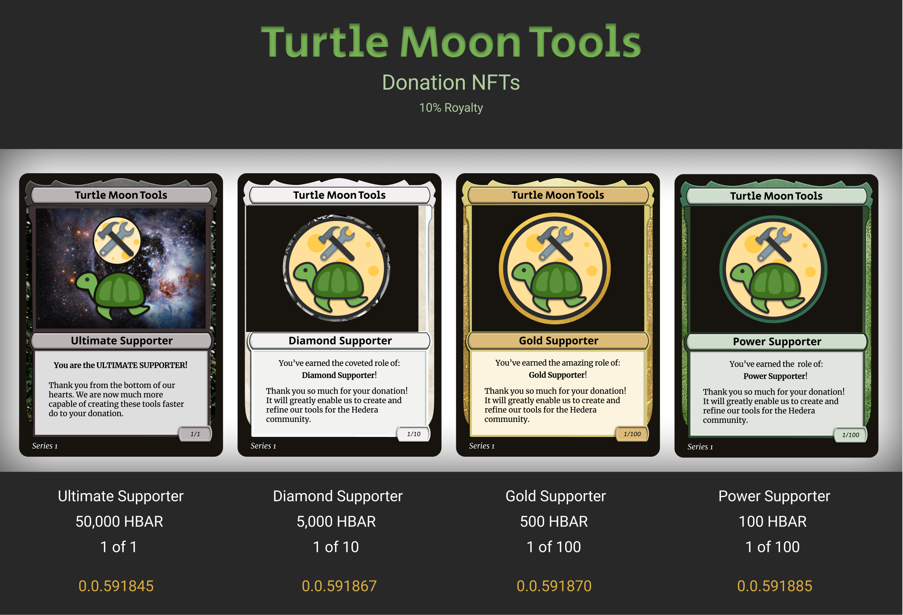
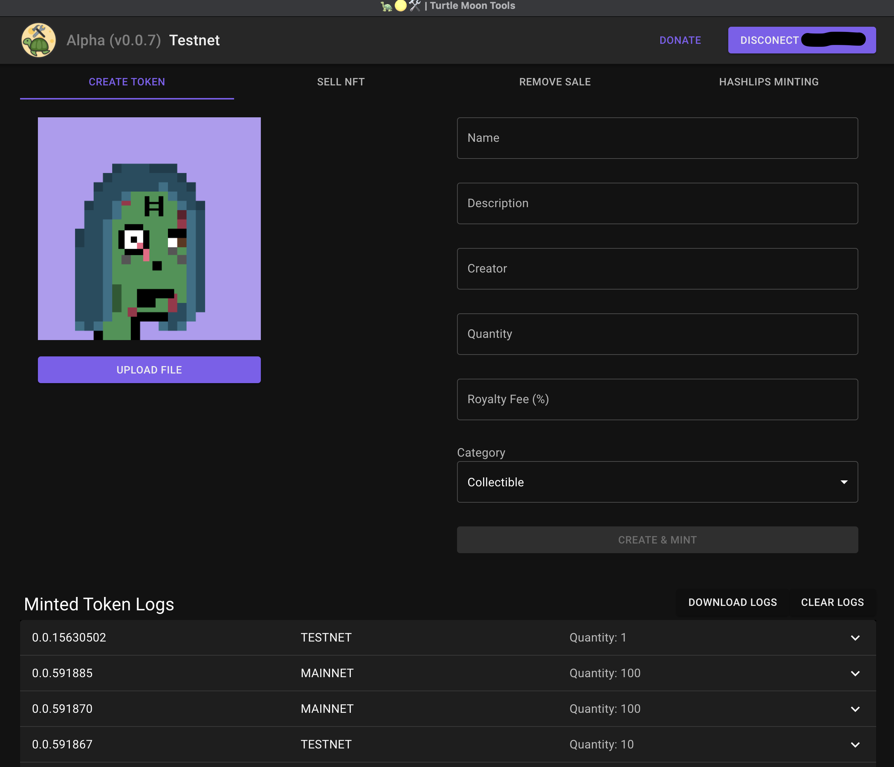

# Turtle Moon Tools (TMT) - Minting

Turtle Moon is the LLC behind the NFT project HGraph Punks 

We want to help build the future of NFTS on Hedera so we've created these tools for our own project, but are open sourcing them to the community to help expedite the growth and speed of NFTs on Hedera. 

# WARNING
# THIS IS IN ALPHA

This codebase is in Alpha, meaning there are a lot of bugs that are still needing to be fixed and enhancements to be integrated. 

We'll be posting a roadmap at [HGraph Punks Medium Blog](https://hgraphpunks.medium.com)

Please use caution with Hashlips Minting. It is working, but the branch to generate Hedera schema is not live yet. That is required for correct minting mass collections. We also have not added fee calculation and acceptance yet, which could cause issues mid mint if you don't have enough funds. 

Please join the [Hedera NFT Creator Society](https://discord.gg/R4V2477Gqv) discord and go to the 🐢🌕🛠️ channel for support.

## Getting Started

You will need three accounts to create NFTs with TMT. 

1. Hedera Portal Account:
https://portal.hedera.com/

2. Xact Developer Account:
https://dev.xact.ac/home

3. NFT Storage Account:
https://nft.storage/

## Setting Up The Project Locally

This was created with creat-react-app and npm.

1. Create a copy of env.example and fill in the varaibles with your account credentials
2. Rename the new file to .env
3. Get [Node.js](https://nodejs.org/en/) installed on your device 
4. Install all node modules `npm install`
5. Start tool with `npm start`

## Donations

We appreciate your support
Donation HBAR Wallet Address:

## 0.0.591814

### DM us on twitter @TurtleMoonLLC to purcahse Donation NFTs

## Alpha Screen

